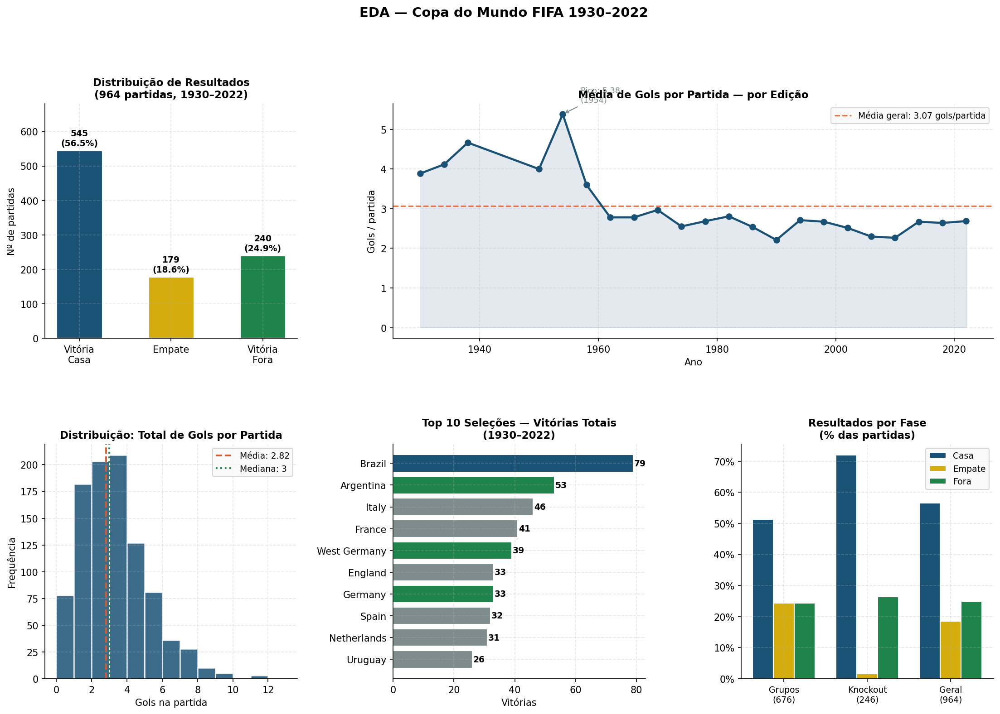
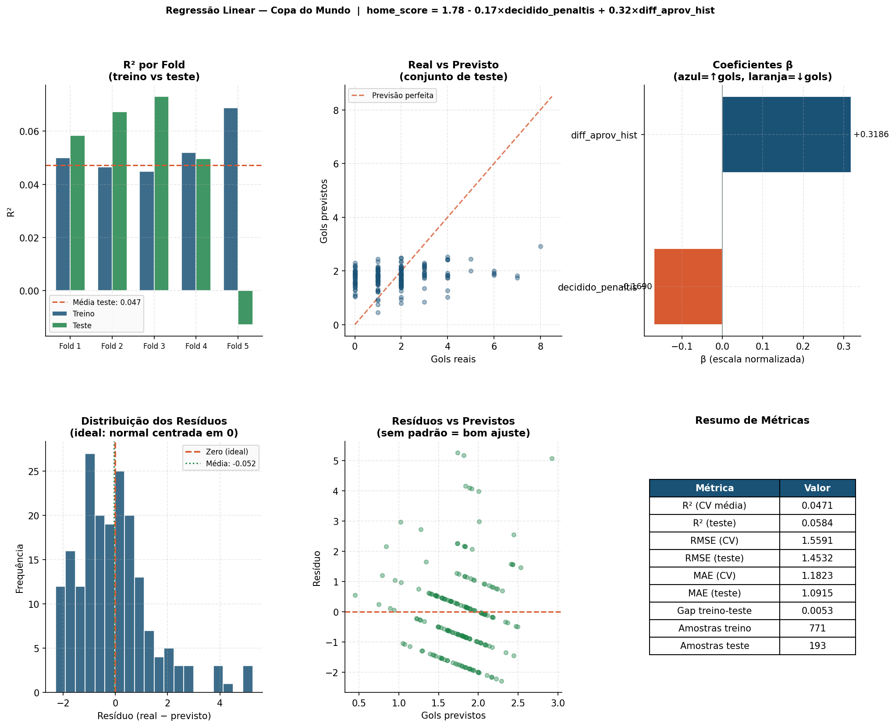

<div align="center">

<!--
  Banner animado — funciona no GitHub Pages e em visualizadores que renderizam HTML/SVG.
  No github.com o GitHub bloqueia animações CSS em SVGs inline por segurança;
  para ver animado, acesse o site do projeto ou abra o arquivo localmente.
-->

<picture>
  <source media="(prefers-color-scheme: dark)" srcset="assets/banner.svg">
  
</picture>

<br/>

# Copa em Dados 2026

### Ciência de Dados, Machine Learning e previsões para a Copa do Mundo FIFA 2026

[](https://python.org)
[](https://pt.wikipedia.org/wiki/SQL)
[](https://sqlite.org)
[](https://pandas.pydata.org)
[](https://scikit-learn.org)
[](https://developer.mozilla.org/pt-BR/docs/Web/JavaScript)

Projeto end-to-end que transforma dados históricos da Copa do Mundo em análise exploratória, engenharia de variáveis, modelos preditivos e um site visual para apresentar previsões da fase de grupos de 2026.

[🔗 Abrir o Site](https://jeeescaribeiro-code.github.io/copa_mundo2026/) &nbsp;•&nbsp; [📄 Documentação Técnica](documentacao.md) &nbsp;•&nbsp; [🖼️ Galeria de Insights](interpretacao.md)

</div>

---

## Visão Geral

Este projeto foi criado para demonstrar um pipeline completo de **Ciência de Dados aplicada ao futebol**.

A proposta não é "adivinhar futebol" — é construir uma análise: entender dados, criar variáveis, treinar modelos, avaliar métricas e explicar limitações.


| Área | O que foi aplicado |
|---|---|
| Engenharia de Dados | ETL, SQL, SQLite, organização de CSVs e pipeline reproduzível |
| Análise de Dados | EDA, estatísticas descritivas, visualizações e leitura crítica |
| Machine Learning | Regressão linear, regressão logística, validação cruzada e métricas |
| Feature Engineering | Histórico das seleções, ranking FIFA, médias de gols e variáveis pré-jogo |
| Comunicação | README, documentação técnica, PDF estatístico e site em HTML/CSS/JS |

**Palavras-chave:** `Python`, `SQL`, `SQLite`, `pandas`, `NumPy`, `Machine Learning`, `Data Science`, `Data Analytics`, `ETL`, `EDA`, `Feature Engineering`, `FIFA Ranking`, `API Integration`, `Linear Regression`, `Logistic Regression`, `Classification`, `Cross-Validation`, `Model Evaluation`, `R2`, `RMSE`, `MAE`, `Accuracy`, `F1 Score`, `ROC AUC`, `Predictive Analytics`, `Statistical Analysis`, `HTML`, `CSS`, `JavaScript`.

---

## Perguntas do Projeto

O projeto usa dois modelos porque responde duas perguntas diferentes:

| Pergunta | Tipo de problema | Modelo usado | Saída |
|---|---|---|---|
| Quantos gols a seleção mandante tende a marcar? | Regressão | Regressão linear | `pred_home` |
| A seleção mandante vence ou não vence? | Classificação binária | Regressão logística | `prob_home_win` |

---

## Como Funciona

1. **Ingestão:** scripts SQL históricos são convertidos para SQLite e CSV.
2. **EDA:** gráficos e estatísticas exploram gols, vitórias, empates, fases e seleções.
3. **Limpeza:** nomes de seleções são padronizados e colunas numéricas são tratadas.
4. **Feature engineering:** variáveis pré-jogo — aproveitamento histórico, média de gols, experiência e ranking FIFA temporal.
5. **Seleção de features:** Pearson, RFECV, LassoCV e VIF ajudam a escolher variáveis relevantes.
6. **Modelagem:** regressão linear estima `home_score`; regressão logística estima `home_win`.
7. **Predição:** a tabela oficial da Copa 2026 é combinada com as features para gerar `output/predicoes_2026.csv`.
8. **Comunicação:** site em HTML, CSS e JavaScript apresenta os resultados de forma visual.

---

## Resultados

### Regressão Linear — previsão de gols

| Métrica | Resultado | Interpretação |
|---|---:|---|
| R² médio (CV) | 0.0857 | Explica uma parte pequena da variação dos gols |
| RMSE médio (CV) | 1.5131 | Penaliza erros grandes |
| MAE médio (CV) | 1.1588 | Erro absoluto médio em gols |
| R² no teste | 0.0581 | Baixo — coerente com a imprevisibilidade de placares |
| RMSE no teste | 1.6012 | Erro no conjunto de teste |
| MAE no teste | 1.2033 | Erro médio aproximado em gols |

### Regressão Logística — chance de vitória do mandante

| Métrica | Resultado | Interpretação |
|---|---:|---|
| Accuracy média (CV) | 0.6971 | Proporção média de classificações corretas |
| F1 médio (CV) | 0.7502 | Equilíbrio entre precisão e recall |
| ROC AUC médio (CV) | 0.7327 | Separação entre vitória e não vitória |
| Accuracy no teste | 0.6839 | Desempenho no conjunto de teste |
| F1 no teste | 0.7359 | Métrica balanceada da classificação |
| ROC AUC no teste | 0.7635 | Boa capacidade de separação para um baseline interpretável |

> **Leitura:** prever placar exato é mais difícil do que prever tendência de resultado. O R² baixo da regressão linear revela uma limitação real do problema — e o projeto é honesto sobre isso.

---

## Visualizações

### Análise exploratória



### Avaliação do modelo



---

## Variáveis Principais

As variáveis finais usam apenas informações disponíveis **antes** da partida:

```text
aprov_hist_home           diff_aprov_hist
media_gols_pro_hist_home  media_gols_contra_hist_away
diff_media_gols_pro_hist  diff_media_gols_contra_hist
diff_saldo_medio_hist     partidas_hist_home
diff_partidas_hist        ranking_home
diff_ranking              ranking_points_home
diff_ranking_points       ranking_available_home
ranking_available_away    fase_ordinal
fase_knockout
```

> Variáveis pós-jogo, como decisão por pênaltis, não entram no modelo — gerariam **vazamento de informação**.

---

## Estrutura do Repositório

```text
copa_mundo/
├── dataset/                          # Dados e tabela oficial da Copa 2026
├── ranking/                          # Rankings FIFA históricos e ranking 2026
├── output/                           # CSVs, métricas, modelos, imagens e predições
├── scripts/                          # Scripts auxiliares de ranking, treino, site e PDF
├── site/                             # Site em HTML, CSS e JavaScript
├── assets/
│   ├── banner.svg                    # Banner animado do projeto
│   └── fluxograma_pipeline.svg       # Fluxograma do pipeline
├── ingestao_dados.py                 # ETL: SQL → SQLite → CSV
├── eda.py                            # Análise exploratória e visualizações
├── limpeza.py                        # Limpeza, padronização e features históricas
├── features.py                       # Seleção e validação de features
├── modelo.py                         # Experimentos de modelagem
└── README.md
```

---

## Site

O projeto inclui um site em HTML, CSS e JavaScript puro para divulgar a análise como portfólio. Ele mostra o pipeline, as métricas, os dois modelos e as predições da Copa 2026.

🔗 **[jeeescaribeiro-code.github.io/copa_mundo2026](https://jeeescaribeiro-code.github.io/copa_mundo2026/)**

---

## Documentação

| Arquivo | Conteúdo |
|---|---|
| [documentacao.md](documentacao.md) | Explicação completa do projeto, variáveis, modelos, métricas e decisões |
| [interpretacao.md](interpretacao.md) | Galeria com interpretação das imagens geradas no projeto |

---

## Sobre o Resultado

O projeto não promete acertar futebol com perfeição. Ele mostra **uma abordagem**: dados organizados, variáveis explicáveis, validação, métricas e limitações assumidas com honestidade.

---

<div align="center">

**Copa em Dados 2026**
Projeto de portfólio em Ciência de Dados, Machine Learning e visualização de dados.

</div>
