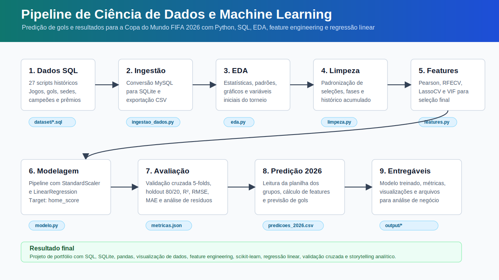

# Documentação Técnica: Copa em Dados 2026

Esta documentação explica o projeto do início ao fim: dados, variáveis, modelos, métricas, equações, arquivos gerados e reprodução local.



## 1. Visão Geral

O projeto usa dados históricos da Copa do Mundo FIFA para criar previsões para a fase de grupos de 2026. A modelagem foi separada em duas perguntas:

```text
Pergunta 1: quantos gols o mandante deve marcar?
Modelo: regressão linear.
Saída: pred_home.

Pergunta 2: o mandante vence ou não vence?
Modelo: regressão logística.
Saída: prob_home_win e home_win_previsto.
```

Essa separação é importante porque placar e resultado são problemas diferentes. Prever gols exige estimar um valor numérico. Prever vitória exige estimar uma classe ou probabilidade.

## 2. Como Copiar e Executar

Requisitos principais:

```text
Python
pandas
NumPy
scikit-learn
statsmodels
Matplotlib
Node.js, apenas para scripts auxiliares do site
```

Ordem de execução recomendada:

```bash
python ingestao_dados.py
python eda.py
python limpeza.py
python features.py
python scripts/baixar_ranking_fifa_2026.py
python scripts/treinar_modelos.py
```

## 3. Estrutura dos Arquivos

```text
ingestao_dados.py
```
Carrega a base histórica, cria o banco SQLite e exporta tabelas em CSV.

```text
eda.py
```
Faz análise exploratória: distribuição de gols, resultados, fases, seleções, campeões e gráficos de apoio.

```text
limpeza.py
```
Padroniza seleções, trata colunas e cria variáveis históricas acumuladas antes de cada jogo.

```text
features.py
```

Avalia variáveis candidatas com correlação de Pearson, RFECV, LassoCV e VIF.

```text
scripts/ranking_utils.py
```

Enriquece jogos com ranking FIFA disponível antes da data da partida.

```text
scripts/baixar_ranking_fifa_2026.py
```

Baixa o ranking masculino atual usado para os jogos de 2026.

```text
scripts/treinar_modelos.py
```

Treina a regressão linear e a regressão logística, calcula métricas e gera as predições.

## 4. Dados Utilizados

O projeto tem:

```text
Dados históricos de Copas
Tabela oficial da fase de grupos de 2026
Rankings FIFA históricos de 1992 a 2024
Ranking FIFA masculino de 2026
```

Para jogos anteriores à criação do ranking FIFA, o projeto usa valores neutros e marca a disponibilidade com `ranking_available_home` e `ranking_available_away`.

## 5. Variáveis

### Targets

`home_score`: gols feitos pela seleção registrada como mandante. É o alvo da regressão linear.

`home_win`: vale `1` quando o mandante vence e `0` quando empata ou perde. É o alvo da regressão logística.

### Variáveis históricas

`aprov_hist_home`: aproveitamento histórico do mandante antes do jogo.

`aprov_hist_away`: aproveitamento histórico do visitante antes do jogo.

`diff_aprov_hist`: diferença entre aproveitamento do mandante e do visitante.

`media_gols_pro_hist_home`: média histórica de gols feitos pelo mandante.

`media_gols_pro_hist_away`: média histórica de gols feitos pelo visitante.

`diff_media_gols_pro_hist`: diferença entre médias ofensivas.

`media_gols_contra_hist_home`: média histórica de gols sofridos pelo mandante.

`media_gols_contra_hist_away`: média histórica de gols sofridos pelo visitante.

`diff_media_gols_contra_hist`: diferença entre médias defensivas.

`saldo_medio_hist_home`: saldo médio histórico do mandante.

`saldo_medio_hist_away`: saldo médio histórico do visitante.

`diff_saldo_medio_hist`: diferença entre saldos médios.

`partidas_hist_home`: quantidade de jogos anteriores do mandante em Copas.

`partidas_hist_away`: quantidade de jogos anteriores do visitante em Copas.

`diff_partidas_hist`: diferença de experiência histórica em Copas.

### Variáveis de ranking FIFA

`ranking_home`: posição do mandante no ranking FIFA disponível antes da partida. Números menores indicam seleções melhor ranqueadas.

`ranking_away`: posição do visitante no ranking FIFA.

`diff_ranking`: diferença entre rankings.

`ranking_points_home`: pontuação FIFA do mandante.

`ranking_points_away`: pontuação FIFA do visitante.

`diff_ranking_points`: diferença de pontos FIFA.

`ranking_available_home`: indica se havia ranking disponível para o mandante.

`ranking_available_away`: indica se havia ranking disponível para o visitante.

### Variáveis de contexto

`fase_ordinal`: fase transformada em número, para o modelo entender a ordem do torneio.

`fase_knockout`: indica se a partida é de mata-mata. Na fase de grupos vale `0`; no mata-mata vale `1`.

### Saídas de predição

`pred_home`: gols estimados para o mandante.

`pred_away`: gols estimados para o visitante, calculados ao inverter a perspectiva do confronto.

`resultado_previsto`: leitura do placar estimado pela regressão linear.

`prob_home_win`: probabilidade de vitória do mandante estimada pela regressão logística.

`home_win_previsto`: classificação final da regressão logística, usando limite de 0.5.

`classificacao_prevista`: texto final da classificação, como "Brasil vence" ou "Brasil não vence".

## 6. Regressão Linear

A regressão linear estima um valor numérico. No projeto, ela estima quantos gols o mandante tende a marcar.

Equação geral:

```text
home_score = intercepto + beta1*x1 + beta2*x2 + ... + betan*xn + erro
```

Leitura em linguagem simples:

```text
home_score = ponto de partida + peso de cada variável + parte não explicada
```

`intercepto` é o valor base quando as variáveis estão no ponto médio usado pelo modelo.

`beta` é o peso de uma variável. Se o peso é positivo, aquela variável empurra a previsão para cima. Se é negativo, empurra para baixo.

`erro` representa tudo que o modelo não consegue explicar: lesões, escalação, clima, cartões, decisão tática, acaso e eventos específicos da partida.

## 7. Regressão Logística

A regressão logística estima uma probabilidade. No projeto, ela estima a chance de o mandante vencer.

Equação geral:

```text
p(home_win = 1) = 1 / (1 + e^-(intercepto + beta1*x1 + beta2*x2 + ... + betan*xn))
```

Leitura em linguagem simples:

```text
O modelo soma os sinais das variáveis e transforma essa soma em uma probabilidade entre 0 e 1.
```

Se `prob_home_win >= 0.5`, o projeto classifica como vitória do mandante. Se for menor que `0.5`, classifica como não vitória do mandante.

## 8. Como as Equações Conversam com as Variáveis

As duas regressões usam as mesmas features principais, mas respondem perguntas diferentes.

Na regressão linear, as features ajudam a estimar quantidade de gols. Exemplo: melhor aproveitamento histórico, melhor ranking e maior força ofensiva podem aumentar a estimativa de gols.

Na regressão logística, as features ajudam a estimar chance de vitória. Exemplo: uma seleção melhor ranqueada pode não ter uma previsão alta de gols, mas ainda pode ter maior probabilidade de vencer.

Por isso é possível que o placar estimado e a probabilidade de vitória nem sempre pareçam idênticos. Eles vêm de modelos diferentes, com objetivos diferentes.

## 9. Métricas

### Regressão linear

`R2`: mostra quanto da variação dos gols o modelo consegue explicar. Quanto mais perto de 1, melhor. No futebol, é comum ser baixo porque placares são muito ruidosos.

`RMSE`: erro médio com penalização maior para erros grandes. Está em unidade de gols.

`MAE`: erro absoluto médio. Também está em gols e costuma ser mais fácil de interpretar.

Resultados:

```text
R2 médio em validação cruzada: 0.0857
RMSE médio em validação cruzada: 1.5131
MAE médio em validação cruzada: 1.1588
R2 no teste: 0.0581
RMSE no teste: 1.6012
MAE no teste: 1.2033
```

Interpretação: o modelo captura alguma tendência, mas não explica a maior parte da variação dos placares. Isso não invalida o projeto; mostra uma limitação real do problema.

### Regressão logística

`Accuracy`: proporção de classificações corretas.

`Precision`: quando o modelo diz que o mandante vence, mede quantas vezes ele acerta.

`Recall`: entre os mandantes que realmente venceram, mede quantos o modelo conseguiu identificar.

`F1 Score`: média harmônica entre precision e recall. É útil quando queremos equilibrar os dois.

`ROC AUC`: mede a capacidade de separar vitórias de não vitórias em diferentes limites de decisão.

`Brier Score`: mede a qualidade das probabilidades. Quanto menor, melhor.

Resultados:

```text
Accuracy média em validação cruzada: 0.6971
F1 médio em validação cruzada: 0.7502
ROC AUC médio em validação cruzada: 0.7327
Accuracy no teste: 0.6839
F1 no teste: 0.7359
ROC AUC no teste: 0.7635
```

Interpretação: a classificação de vitória ou não vitória funciona melhor do que a previsão exata de gols, porque é uma pergunta menos granular.

## 10. Decisões Estatísticas

O uso de regressão linear faz sentido para estimar gols porque `home_score` é uma variável numérica.

O uso de regressão logística faz sentido para estimar vitória porque `home_win` é uma variável binária.

As variáveis pós-jogo foram removidas porque não poderiam ser conhecidas antes da partida. Manter esse tipo de variável causaria vazamento de informação, ou seja, o modelo aprenderia com dados que não estariam disponíveis no momento real da previsão.

## 11. Limitações

O projeto não usa escalações, lesões, suspensões, técnico, forma recente, odds de mercado, dados de finalização, xG ou contexto tático.

O ranking FIFA ajuda, mas não representa sozinho a força real de uma seleção em um jogo específico.

Placar é naturalmente instável. Um único evento muda o jogo inteiro.

## 12. Próximos Passos

Adicionar Elo rating.

Testar regressão de Poisson para gols.

Adicionar features recentes, como desempenho nos últimos jogos.

Separar mando de campo real de posição oficial na tabela.

Comparar regressão logística com Random Forest, XGBoost ou modelos bayesianos.

Criar um dashboard com filtros por grupo, seleção, ranking e probabilidade.

## 13. Arquivos de Saída

```text
output/predicoes_2026.csv
output/metricas.json
output/modelo_regressao_linear.json
output/modelo_regressao_logistica.json
output/avaliacao_modelo.png
output/eda_visao_geral.png
output/eda_selecoes.png
```

