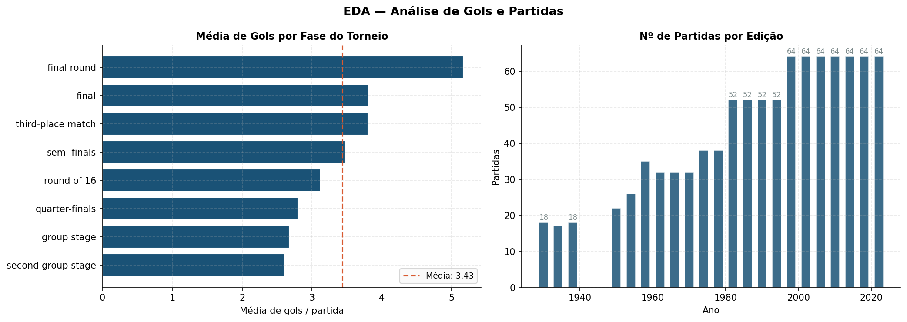
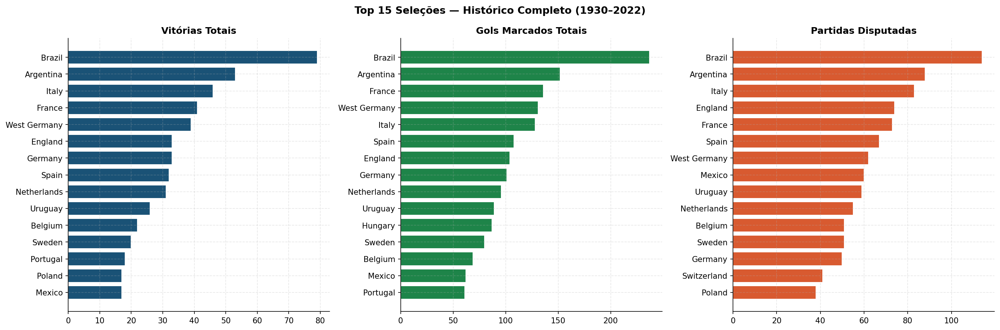
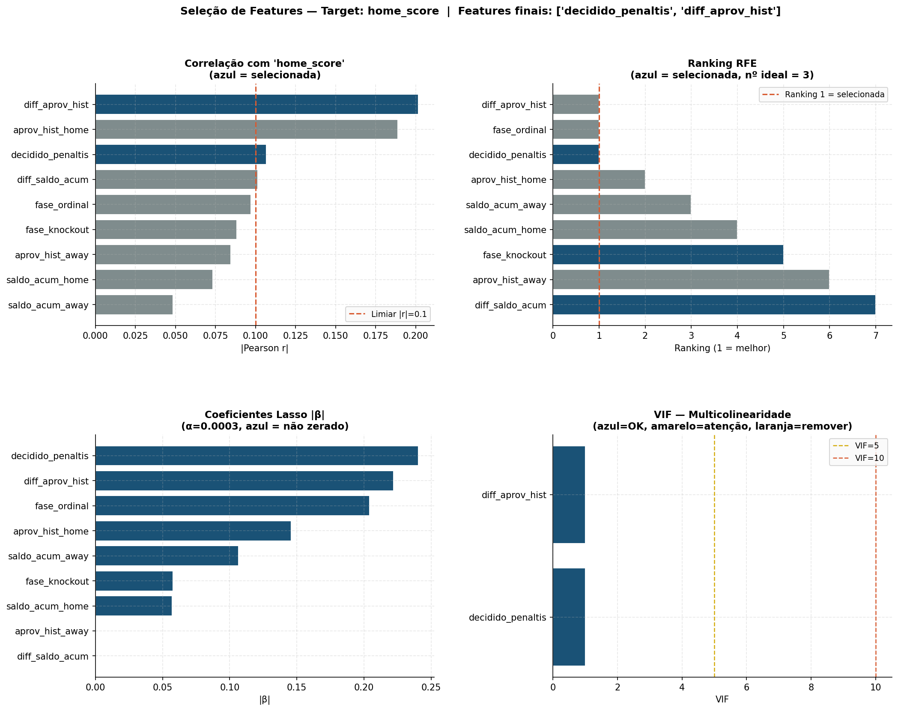
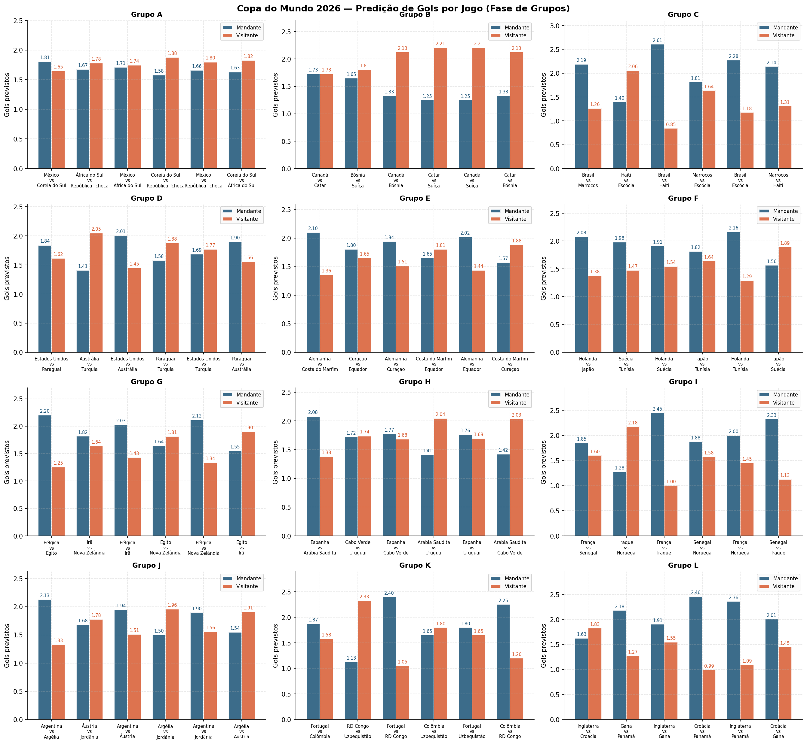

# Galeria de Insights do Projeto

Esta página reúne as principais imagens geradas durante a análise e explica o que cada visual mostra dentro do projeto **Copa em Dados 2026**.

---

## 1. Visão Geral da Copa do Mundo

### O que este painel mostra

Este painel apresenta uma visão geral dos jogos da Copa do Mundo entre 1930 e 2022.

Ele resume:

- distribuição de vitórias, empates e derrotas;
- média de gols por edição;
- distribuição do total de gols por partida;
- seleções com mais vitórias;
- comportamento dos resultados por fase do torneio.

### Interpretação

A maior parte dos jogos termina com vitória da seleção listada como mandante. No contexto da Copa, “mandante” é a equipe que aparece primeiro na tabela, não necessariamente quem joga em casa.

A média de gols por edição mostra que as Copas mais antigas tiveram placares mais altos, enquanto as edições recentes apresentam médias mais estáveis. Isso sugere que o futebol moderno tende a ser mais equilibrado e defensivamente organizado.

A distribuição de gols mostra que a maioria das partidas fica concentrada entre 2 e 4 gols. Esse comportamento ajuda a explicar por que prever placares exatos é difícil: pequenas diferenças no jogo podem mudar completamente o resultado.

O painel também mostra a força histórica do Brasil, que aparece como a seleção com mais vitórias no período analisado.

### Por que isso importa para o modelo

Essa imagem ajuda a justificar a escolha de variáveis históricas, como:

- aproveitamento acumulado;
- média histórica de gols;
- saldo médio;
- experiência em Copas;
- contexto da fase do torneio.

---

## 2. Gols e Estrutura do Torneio

### O que este painel mostra

Este visual aprofunda a análise de gols e partidas.

Ele apresenta:

- média de gols por fase do torneio;
- número de partidas por edição da Copa do Mundo.

### Interpretação

A média de gols muda conforme a fase. Isso indica que a fase do torneio pode influenciar o comportamento das partidas. Jogos de mata-mata, por exemplo, podem ter estratégias diferentes de jogos da fase de grupos.

O número de partidas por edição mostra a expansão histórica da Copa do Mundo. As edições mais recentes têm mais jogos, refletindo o aumento do número de seleções participantes.

### Por que isso importa para o modelo

A estrutura do torneio muda ao longo do tempo, então o modelo precisa considerar o contexto da partida. Por isso entram variáveis como:

- `fase_ordinal`;
- `fase_knockout`;
- histórico acumulado das seleções antes de cada jogo.

---

## 3. Seleções Mais Relevantes no Histórico

### O que este painel mostra

Este painel compara as principais seleções da história das Copas em três dimensões:

- vitórias totais;
- gols marcados;
- partidas disputadas.

### Interpretação

O Brasil aparece como destaque nos três gráficos, reforçando sua presença histórica em Copas do Mundo. Argentina, Itália, França, Alemanha, Inglaterra, Espanha, Holanda e Uruguai também aparecem como seleções relevantes no histórico.

A comparação entre partidas, gols e vitórias ajuda a separar volume de desempenho. Uma seleção pode ter muitas partidas disputadas porque participou de muitas edições, mas isso não significa automaticamente que tenha o melhor aproveitamento.

### Por que isso importa para o modelo

Essa leitura sustenta a criação de variáveis históricas, como:

- `partidas_hist_home`;
- `diff_partidas_hist`;
- `media_gols_pro_hist_home`;
- `diff_media_gols_pro_hist`;
- `aprov_hist_home`;
- `diff_aprov_hist`.

Essas variáveis ajudam o modelo a entender a experiência e o desempenho acumulado das seleções antes de cada confronto.

---

## 4. Seleção de Variáveis

### O que este painel mostra

Este painel mostra como diferentes técnicas estatísticas ajudam a avaliar variáveis candidatas para prever `home_score`, ou seja, os gols da seleção mandante.

As técnicas apresentadas são:

- correlação de Pearson;
- RFECV;
- Lasso;
- VIF.

### Interpretação

A correlação de Pearson mede o quanto cada variável se relaciona linearmente com os gols do mandante. Quanto maior o valor absoluto, maior a associação linear.

O RFECV avalia subconjuntos de variáveis usando validação cruzada. Ele ajuda a identificar quais colunas contribuem mais para o desempenho do modelo.

O Lasso aplica uma penalização nos coeficientes e pode reduzir a importância de variáveis pouco úteis.

O VIF mede multicolinearidade, isto é, quando variáveis carregam informação muito parecida. Valores baixos são desejáveis porque indicam menor redundância entre os sinais usados pelo modelo.

### Por que isso importa para o modelo

Essa etapa mostra que as features não foram escolhidas aleatoriamente. Houve uma análise estatística para selecionar variáveis com maior potencial explicativo e reduzir ruído.

---

## 5. Avaliação da Regressão Linear

### O que este painel mostra

Este painel apresenta a avaliação visual da regressão linear usada para estimar gols.

Ele inclui:

- R² por fold;
- comparação entre valor real e valor previsto;
- coeficientes do modelo;
- distribuição dos resíduos;
- resíduos versus previsões;
- resumo de métricas.

### Interpretação

O R² mostra quanto da variação dos gols o modelo consegue explicar. Como futebol é um fenômeno muito ruidoso, é esperado que esse valor seja baixo quando usamos apenas dados agregados e históricos.

O gráfico de real versus previsto mostra que o modelo captura tendências gerais, mas não acompanha bem placares extremos. Isso reforça uma conclusão importante: prever o número exato de gols é mais difícil do que prever uma tendência de resultado.

Os resíduos mostram os erros do modelo. Idealmente, eles devem ficar distribuídos ao redor de zero. Quando aparecem resíduos altos, isso indica partidas em que o modelo errou mais.

### Por que isso importa para o projeto

Essa imagem reforça uma leitura crítica: o modelo não deve ser vendido como uma ferramenta de certeza absoluta, mas como uma forma de transformar dados históricos em uma previsão interpretável.

Essa postura é importante em Ciência de Dados: tão relevante quanto criar o modelo é saber explicar seus limites.

---

## 6. Predições para a Copa do Mundo 2026

### O que este painel mostra

Este painel apresenta previsões de gols para jogos da fase de grupos da Copa do Mundo 2026.

Cada grupo mostra os confrontos e compara:

- gols previstos para a seleção mandante;
- gols previstos para a seleção visitante.

### Interpretação

Quando a barra do mandante é maior, o modelo sugere vantagem ofensiva para a seleção listada primeiro no confronto. Quando a barra do visitante é maior, sugere vantagem ofensiva para a segunda seleção.

Essas previsões devem ser lidas como estimativas, não como placares garantidos. Diferenças pequenas entre barras indicam jogos mais equilibrados.

### Por que isso importa para o projeto

Esta imagem mostra a aplicação prática do pipeline: os dados históricos são transformados em variáveis, as variáveis alimentam o modelo e o modelo gera uma previsão para confrontos futuros.

No site do projeto, essa leitura é complementada com a probabilidade de vitória estimada pela regressão logística.

---

## Resumo das Imagens

| Imagem | Papel no projeto |
|---|---|
| `eda_visao_geral.png` | Resume padrões históricos da Copa do Mundo |
| `eda_gols_detalhado.png` | Mostra comportamento de gols e expansão do torneio |
| `eda_selecoes.png` | Compara seleções historicamente mais relevantes |
| `eda_features.png` | Explica a seleção estatística de variáveis |
| `avaliacao_modelo.png` | Mostra a avaliação visual da regressão linear |
| `predicoes_2026.png` | Apresenta previsões de gols para a Copa 2026 |
